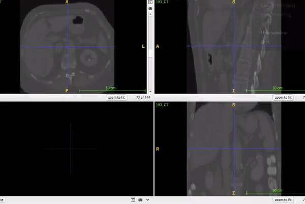
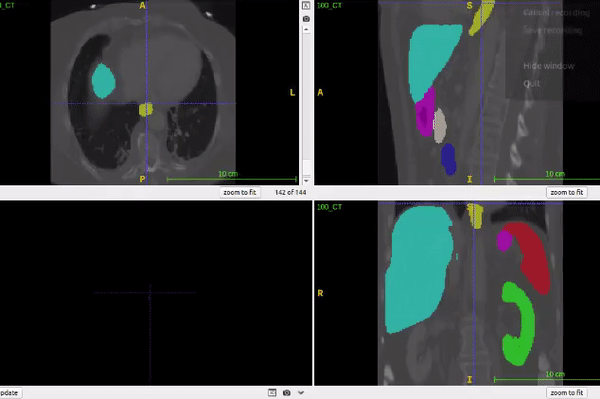

# Multi-Organ-Segmentation
Biomedical Organ Segmentation on multiple organs using V-net model

# Collaborator
Prayushi Mathur, Vraj Patel

This repository contains the file related to Multiple Organ Segmentation using V-net model.

# Introduction
The process of Multiple Organ Segmentation is the process of separating multiple organs by specifying their boundary from other organ tissues. In the technical terms, this process gives the pixel-wise identification of the type of organ present in the MRI/CT images. This further can help the doctor to detect the type and location of the organ in the human body which is challenging task due to irregular form and confusing boundaries of multiple organs. The results include the following information:
- Loss
- Dice-coefficient

# Introduction Of Files Contained In This Repository
- group_norm.py - This file contains the code of group normalization used in the model.
- model_mos.py - This file contains main code of the v-net model.
- mos_tr.py - This file contains the methodology code to run the model.

# Model Description
- It is a three dimensional model.
- The model can detect the following organs in a CT/MRI scan:
(1) spleen
(2) right kidney
(3) left kidney
(4) gallbladder
(5) esophagus
(6) liver
(7) stomach
(8) aorta
(9) inferior vena cava
(10) portal vein and splenic vein
(11) pancreas
(12) right adrenal gland
(13) left adrenal gland
- It contains residual connections along with skip connections.
- Input contains 1-channels
- Output contains 13 channels containing the above mentioned organs.

# Result
 
 
